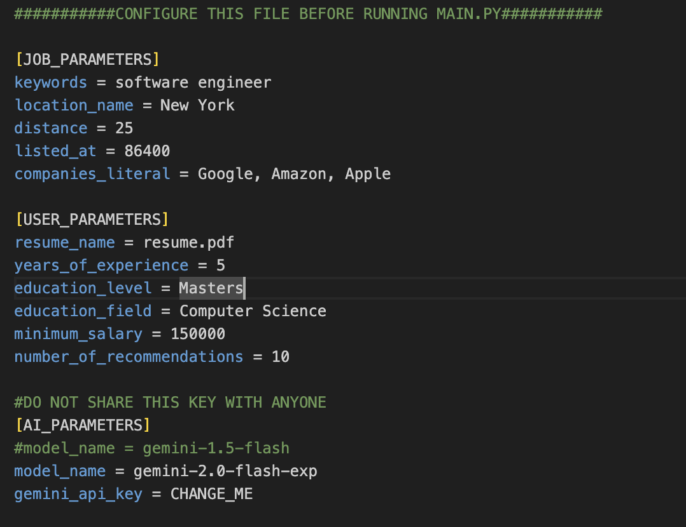
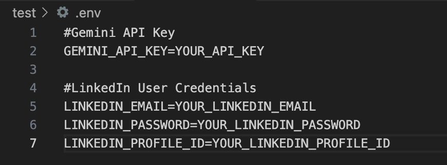
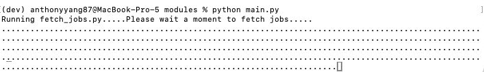
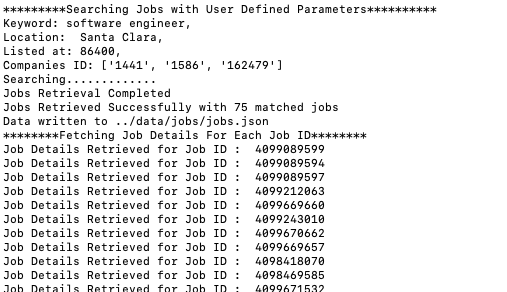
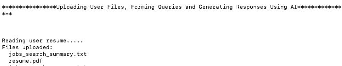
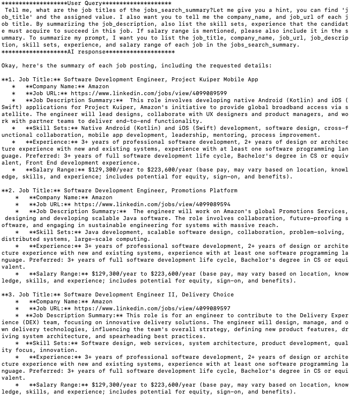
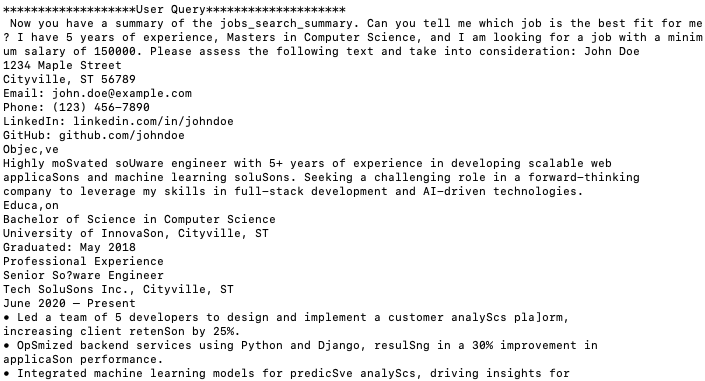
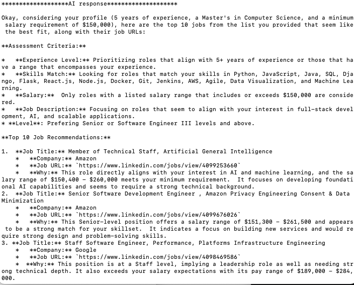
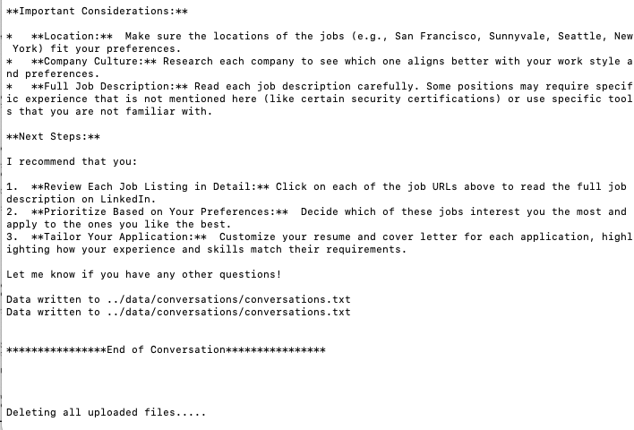
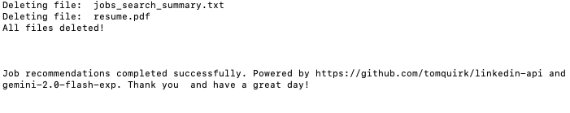

# Hello this is the AI Powered LinkedIn Job Finder
Wecome aboard folks!  
This project aims to help users match their interest/skillset with LinkedIn Jobs, powered by generative AI! Instead of scrolling through hundreds if not thousands of jobs listing to find jobs that falls into your criteria, we (I as if right now) have put together an alternative method that would save you time and increase the chances of matching you with an ideal job! 

## How to Get Started

### Requirements: 
Python 3.12.X

### Installation

Open up a command prompt and enter:  

`git clone https://github.com/anthonyyang87/LinkedIn-Job-Finder.git`  
`cd LinkedIn-Job-Finder`

Then, to install dependencies, run  

`pip install -r requirements.txt`

If you run into installation errors, please resolve before proceeding to the next steps. 

If you don't have pip installed, please visit:   
https://pip.pypa.io/en/stable/installation/

### Setting Up GenAI API Key
This starter kit uses Gemini as a baseline. To retrieve an API access key, please visit https://ai.google.dev/gemini-api/docs/quickstart?lang=python

### Configuring the Parameters and Environment Variables

Navigate to the /app folder and open **config.ini**  There, you can edit user defined parameters for  search queries, user preferences, and the AI Model you want to use. For demonstration purposes, model **gemini-2.0-flash-exp** is used. 

Keep in mind, search results depend on **[JOB_PARAMETERS]**, and it might take time to find a sweet spot. 
* keywords is the title of the role you are interested in
* location_name only works with the city name (Example: Use "New York" instead of "New York, NY")
* distance is in miles
* list_at is defined in seconds
* companies_literal is a string of companies seperated by commas

To let AI better understand your experience and preference, please upload your resume to **/app/resources/**  and edit the other **[USER_PARAMETERS]**  

Finally, update **[AI_PARAMETERS]** with the desired model. In gemini, common models that are **FREE** to test include:  
* gemini-1.5-flash
* gemini-2.0-flash-exp (Note that this is the preferred model due to the large requests we are making)
* gemini-1.5-pro

Example: 

To configure environmet variables, please create a .env file at the root of the directory and make changes to it. The .env file will be used to store credentials that will later be used for linkedin-api and genai requests. Please make sure that .env is not uploaded by specifying in a .gitignore file. 

Example:  

### Running the Script and Collecting Results

Once you are done configuring the .env and config.ini, it's show time! 

Navigate to /app/modules/ and run:  
`python main.py`

Depending on your setup, you might have use python3 or python312 to run. 

Depending on the traffic, and the search parameters, it might take a while for job to return.  For the parameters specified above, it takes ~5 minutes for the job to complete.

The flow is described as 

* Job search 
* Parse and Extract Relevant Job information (Not all information is useful to AI, such as the CSS layout of the job listing)
* Prompt AI to Analyze and Summarize JoB
* Prompt AI To Fetch Top Jobs that Matches User Resume and Preference

Sample Output from Command Prompt/Terminal:  

*Retriving Data for Each Job ID*  
  

*Uploading Jobs and Resume to AI Datastore*  

*AI Summarzing Jobs*  
  

*AI Matching User with Jobs*  

*Top Matched Jobs*

*Feedback From AI*

*Removing Uploaded Files upon Job Completion*

### Common Debugging Strategies

* If the script haves trouble fetching jobs it could be due to - mispelling of *location* (keep in mind that only use city name), company name typo, or the *listed_at* value being too large. Please start with smaller *listed_at/distance* numbers and a few companies for better results. 

## Resources

* LinkedIn-API https://github.com/tomquirk/linkedin-api
* Gemini API Doc (python) https://ai.google.dev/gemini-api/docs/quickstart?lang=python

## Further and Beyond

This is the initial phase of integrating Job Search with AI, and there's a long way to go. Feel free to use and contribute. Happy coding! 